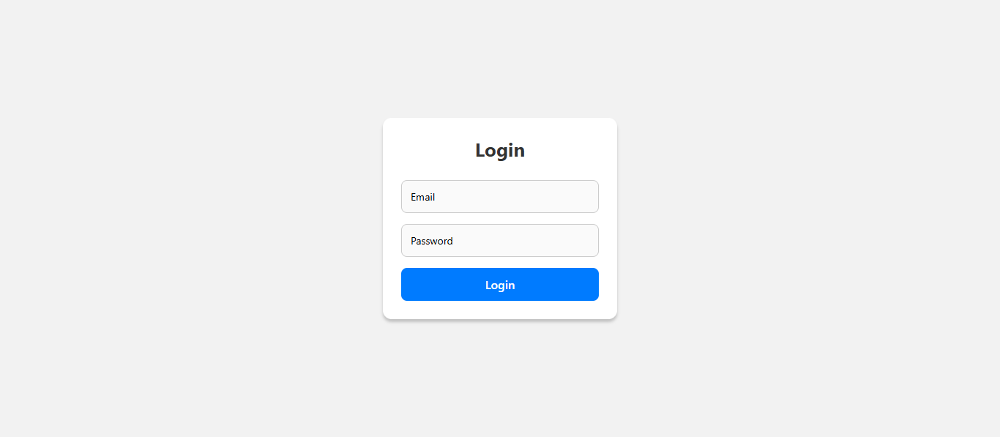
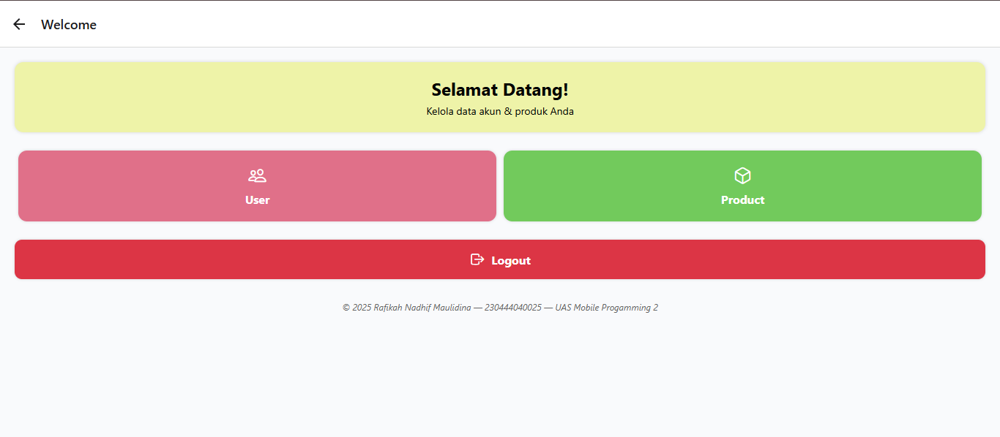
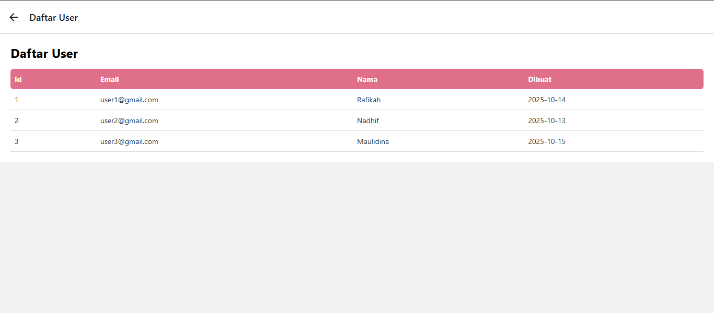
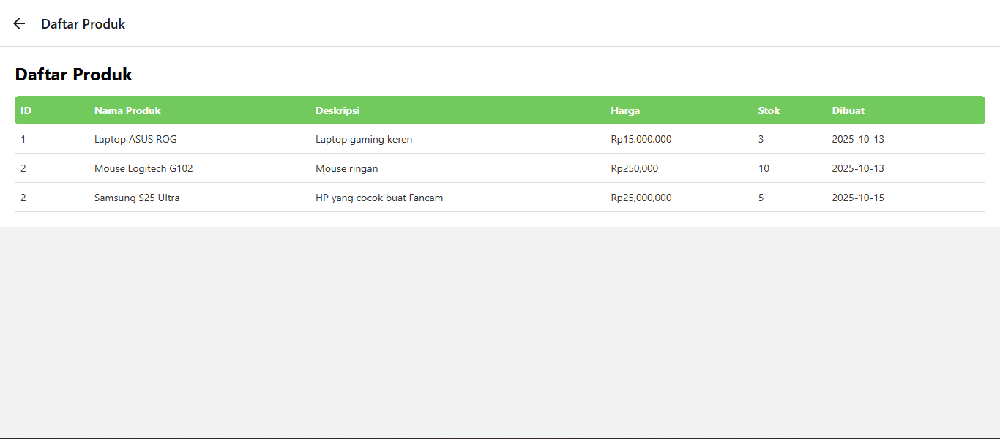
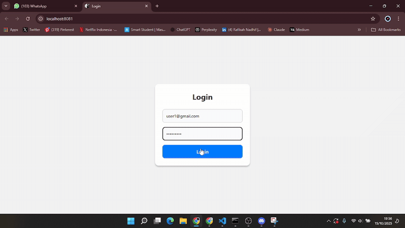

# UAS Mobile Progamming 2 
Rafikah Nadhif Maulidina
230444040025 - Manajemen Informatika

Proyek ini adalah aplikasi sederhana berbasis **React Native** dengan server **Node.js**, dibuat sebagai tugas UAS. Aplikasi ini menampilkan navigasi antar halaman serta data dummy untuk **users** dan **products**.

---

## 🔧 Persiapan Server

Agar server otomatis memuat ulang saat ada perubahan, gunakan **nodemon**:

npm install -g nodemon (install ini)
nodemon main.js (perintah untuk menjalankan)

## 📸 Dokumentasi

### 🖼️ Tampilan Aplikasi

### 🎞️ Demo Aplikasi

